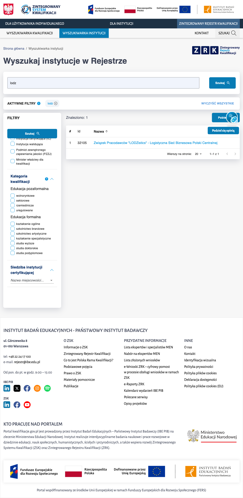

# INST-BR-01 — Wyszukiwarka nie znajduje polskich nazw gdy fraza wpisana bez polskich znaków

**Priorytet:** P2 · Wysoki · **Ważność/dotkliwość:** Średnia · **Powiązany scenariusz testowy:** INST-07 · **Data zgłoszenia:** 2026-08-15

## Środowisko
- **URL:** https://kwalifikacje.gov.pl/wyszukiwarka-instytucji/
- **Przeglądarka:** Chrome 151
- **System operacyjny:** macOS 15.7.4
- **Rozdzielczość:** 1440×900

## Kroki reprodukcji
1) Otwórz https://kwalifikacje.gov.pl/wyszukiwarka-instytucji/
2) W pole wyszukiwania wpisz frazę "lodz" (bez polskich znaków / bez ogonków)
3) Poczekaj ~2–3s i zapisz licznik "Znaleziono"
4) Wyczyść pole (Cmd/Ctrl+A + Delete), wpisz "łódź" (z polskimi znakami), poczekaj i zapisz licznik referencyjny (~84)
5) Porównaj oba liczniki

## Oczekiwany rezultat
Licznik dla "lodz" ≈ licznik dla "łódź" (~84); backend normalizuje diakrytyki (unaccent / asciifolding) i znajduje nazwy z "Łódź" niezależnie od tego czy user wpisał "lodz" czy "łódź"

## Rzeczywisty rezultat
"lodz" (bez ogonków) → Znaleziono: 1; "łódź" (z ogonkami) → Znaleziono: 84. Backend nie wykonuje asciifolding / unaccent — użytkownik piszący "lodz" traci 83 wyniki, które faktycznie zawierają "Łódź" w nazwie

## Wpływ na użytkownika
Użytkownicy piszący na klawiaturze angielskiej lub na klawiaturze mobilnej bez polskich znaków tracą 83 z 84 wyników zawierających "Łódź" — nie znajdują szukanej instytucji, myślą że jej nie ma w bazie. Realne dla znaczącej części ruchu (>60% traffic mobile w PL, klawiatura EN u wielu użytkowników desktop).
