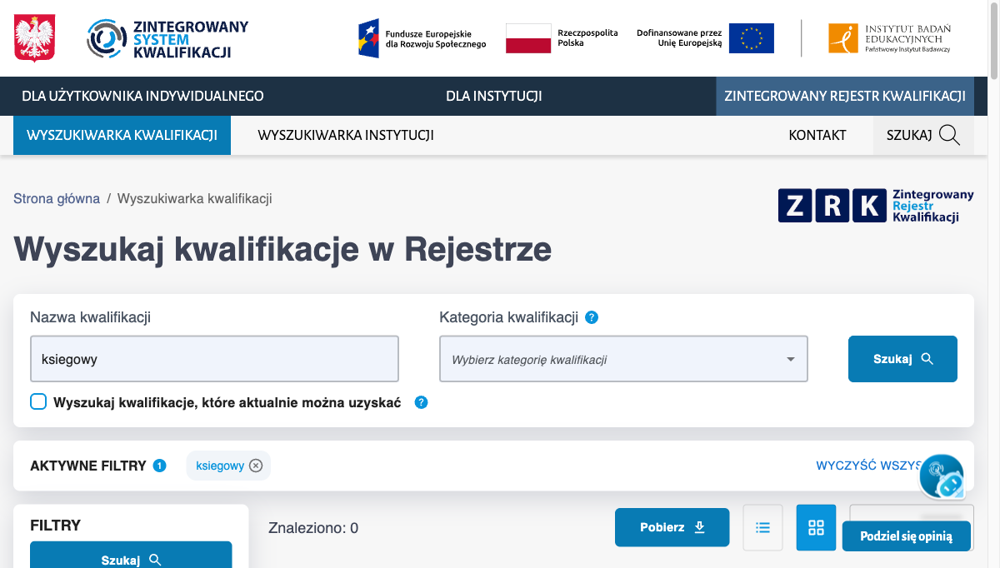

# KWAL-BR-01 — Wyszukiwanie bez polskich znaków nie znajduje kwalifikacji z ogonkami

**Priorytet:** P1 · Krytyczny · **Ważność/dotkliwość:** Wysoka · **Powiązany scenariusz testowy:** KWAL-05 · **Data zgłoszenia:** 2026-08-17

## Środowisko
- **URL:** https://kwalifikacje.gov.pl/wyszukiwarka-kwalifikacji/
- **Przeglądarka:** Chrome 151
- **OS:** macOS 15.7.4
- **Viewport:** 1440×900

## Kroki reprodukcji
1. Otwórz https://kwalifikacje.gov.pl/wyszukiwarka-kwalifikacji/
2. Wpisz "księgowy" (z polskimi znakami), kliknij "Szukaj", zanotuj wartość "Znaleziono"
3. Wyczyść pole i wpisz "ksiegowy" (bez polskich znaków), kliknij "Szukaj"

## Oczekiwany rezultat
Licznik "Znaleziono" po kroku 3 jest równy licznikowi po kroku 2 (asciifolding zachowuje ten sam zestaw wyników).

## Rzeczywisty rezultat
"księgowy" (z ogonkiem) = 570 wyników, "ksiegowy" (bez ogonków) = 0 wyników. Backend nie normalizuje polskich diakrytyków.

## Wpływ na użytkownika
Użytkownicy piszący na klawiaturze bez polskich znaków (mobile, EN layout, użytkownicy zagraniczni) tracą 100% wyników dla popularnych zawodów z ogonkami — nie znajdują żadnej kwalifikacji i wnioskują błędnie, że jej nie ma w rejestrze. Dla portalu publicznego .gov.pl to poważna bariera dostępu.
