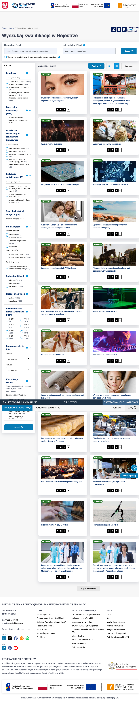

# KWAL-BR-02 — Przycisk "Więcej kwalifikacji" dodaje 9 pozycji zamiast 15 wynikających z limitu URL

**Priorytet:** P2 · Wysoki · **Ważność/dotkliwość:** Średnia · **Powiązany scenariusz testowy:** KWAL-22 · **Data zgłoszenia:** 2026-08-17

## Środowisko
- **URL:** https://kwalifikacje.gov.pl/wyszukiwarka-kwalifikacji/
- **Przeglądarka:** Chrome 151
- **OS:** macOS 15.7.4
- **Viewport:** 1440×900

## Kroki reprodukcji
1. Otwórz https://kwalifikacje.gov.pl/wyszukiwarka-kwalifikacji/
2. Policz kafelki na liście (powinno być 15)
3. Przewiń na dół listy i kliknij przycisk "Więcej kwalifikacji"
4. Policz kafelki ponownie

## Oczekiwany rezultat
Po kliknięciu na liście widocznych jest 30 kafelków (poprzednie 15 + kolejne 15); poprzednie kafelki pozostają widoczne w tej samej kolejności.

## Rzeczywisty rezultat
Po pierwszym kliknięciu: 24 kafelki (dodano 9), URL zmienia się na offset=24 zamiast 15. Po drugim kliknięciu: 33 kafelki (dodano kolejne 9). Rozmiar porcji ładowanej na klik (9) nie zgodny z parametrem limit=15 w URL.

## Wpływ na użytkownika
Użytkownicy przeglądający zawężone listy muszą klikać "Więcej" o 66% więcej razy niż sugeruje parametr limit=15 w URL — psuje przewidywalność paginacji i wydłuża czas przeglądania (szczególnie dotkliwe przy dużych listach). Niespójność między parametrem URL a rzeczywistym batch size utrudnia deep-link i bookmarki.
