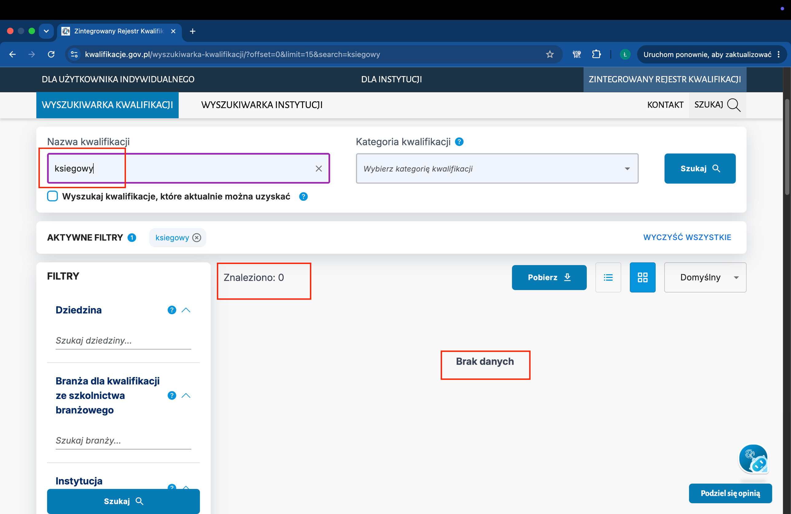
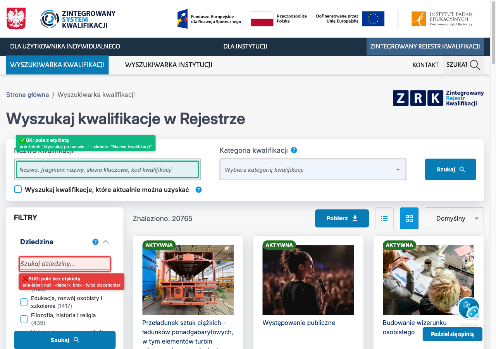

# ZADANIE REKRUTACYJNE — TESTER MANUALNY (QA)

**Portal:** kwalifikacje.gov.pl
**Moduł testowany:** Wyszukiwarka kwalifikacji
**URL:** https://kwalifikacje.gov.pl/wyszukiwarka-kwalifikacji/
**Data testu:** 2026-07-08
**Autor:** Łukasz Posmyk

---

## Założenia i decyzje interpretacyjne

1. **Zakres testów:**
   - **Funkcjonalny:** moduł "Wyszukiwarka kwalifikacji" (`/wyszukiwarka-kwalifikacji/`) — pole nazwy, wyniki, brak wyników, deep-link `?search=`, paginacja (`offset`, `limit`), wszystkie sekcje filtrów (Dziedzina, Branża, Instytucja certyfikująca, Studia wyższe, Status kwalifikacji, Rodzaj kwalifikacji, PRK, ISCED, Data włączenia do ZSK oraz checkbox "aktualnie można uzyskać"), kombinacja filtrów (AND), reset przez "WYCZYŚĆ WSZYSTKIE".
   - **Dostępność (WCAG 2.2 AA):** portal rządowy podlega Ustawie o dostępności cyfrowej stron internetowych i aplikacji mobilnych podmiotów publicznych — 3 wybrane kryteria (nazwa+rola kontrolek, focus visible, keyboard).
   - **Poza zakresem:** wyszukiwarka instytucji, karty szczegółów kwalifikacji, menu portalu, dialog cookies (zgodnie z wymaganiem zadania).

2. **Środowisko testowe:**
   - System operacyjny: macOS 15.7.4 (Sequoia), build 24G517
   - Przeglądarka: Google Chrome 149.0.7827.201 (desktop, 64-bit)
   - Ekran: MacBook Liquid Retina 2560×1664 (skalowanie systemowe)
   - Moduł wyszukiwarki: `https://components.ibe.edu.pl/qualifications-searcher/`
   - API danych: `https://zrk-api.ibe.edu.pl/pl/v1/qualifications/`

3. **Kluczowe interpretacje:**
   - **"Krytyczne test cases/bugi"** = istotnie pogarszające podstawowy przepływ (search → wyniki) lub łamiące wymóg WCAG 2.2 AA.
   - **Autocomplete** wyzwala się po 2+ znakach — traktuję to jako standardowe zachowanie MUI Autocomplete.

4. **Severity vs Priority** — dwa niezależne wymiary oceny defektu:
   - **Severity** — techniczna dotkliwość: Blocker / Major / Minor / Trivial.
   - **Priority** — biznesowa pilność: **High** (blokada użycia lub WCAG) / **Medium** (ważne, nie blokuje) / **Low** (kosmetyka).

---

## 1. Test cases 

| ID | Warunek wstępny | Kroki | Dane testowe | Wynik oczekiwany | Priority |
|----|-----------------|-------|--------------|------------------|-----------|
| **TC-01** Wyszukiwanie kwalifikacji po nazwie i wybór kategorii z listy | Cookies zaakceptowane | **A) Wyszukiwanie w polu "Nazwa kwalifikacji":** 1. Otwórz https://kwalifikacje.gov.pl/wyszukiwarka-kwalifikacji/ 2. W pierwszym polu ("Nazwa kwalifikacji") wpisz frazę 3. Kliknij przycisk "Szukaj" 4. Sprawdź: liczbę wyników, listę kafelków, adres URL  **B) Wybór z listy w polu "Kategoria kwalifikacji":** 1. Otwórz https://kwalifikacje.gov.pl/wyszukiwarka-kwalifikacji/ 2. Kliknij w drugie pole ("Kategoria kwalifikacji") — rozwinie się lista 11 kategorii 3. Wybierz kategorię z listy 4. Sprawdź: liczbę wyników, adres URL, wybraną wartość w polu | **A)** `kucharz` **B)** `rzemieślnicze` (przy nazwie na liście widnieje liczba 23) | **A)** Liczba wyników = 11, lista kafelków się wyświetla, tag "Aktywne filtry" pokazuje `kucharz`, adres URL kończy się na `?search=kucharz`. **B)** Liczba wyników zawęża się do wartości przy nazwie kategorii (rzemieślnicze → 23), adres URL zawiera `&category=6`, w polu widoczna wybrana kategoria, wyniki należą do wybranej kategorii. | **High** |
| **TC-02** Wyszukiwanie działa niezależnie od polskich znaków (np. "księgowy" vs "ksiegowy") | Cookies zaakceptowane | 1. Otwórz https://kwalifikacje.gov.pl/wyszukiwarka-kwalifikacji/ 2. W polu "Nazwa kwalifikacji" wpisz frazę bez znaków diakrytycznych (bez ę, ś, ó itd.), zapisz liczbę wyników 3. Wyczyść pole 4. Wpisz tę samą frazę ze znakami diakrytycznymi, zapisz liczbę wyników 5. Porównaj obie liczby | `ksiegowy` vs `księgowy` | Obie frazy zwracają **taką samą** liczbę wyników (normalizacja diakrytyków to standard dla języka polskiego).  *Znane defekty przy tym scenariuszu: [BR-01].* | **High** |
| **TC-03** Wyszukiwanie ignoruje wielkość liter i spacje na początku/końcu frazy | Cookies zaakceptowane | 1. Otwórz https://kwalifikacje.gov.pl/wyszukiwarka-kwalifikacji/ 2. W polu "Nazwa kwalifikacji" wpisz frazę WIELKIMI literami, zapisz wynik 3. Wyczyść pole, wpisz z pierwszą wielką literą, zapisz wynik 4. Wyczyść pole, wpisz małymi literami, zapisz wynik 5. Wyczyść pole, wpisz frazę ze spacjami na początku i końcu, zapisz wynik 6. Porównaj wszystkie 4 wyniki | `KSIĘGOWY` / `Księgowy` / `księgowy` / `   księgowy   ` | Wszystkie 4 warianty zwracają tę samą liczbę wyników (568). Wielkość liter nie ma znaczenia, spacje na krańcach są ignorowane. | **Medium** |
| **TC-04** Wpisanie frazy, której nie ma w rejestrze — komunikat "Brak danych" | Cookies zaakceptowane | 1. Otwórz https://kwalifikacje.gov.pl/wyszukiwarka-kwalifikacji/ 2. W polu "Nazwa kwalifikacji" wpisz frazę, której na pewno nie ma w rejestrze 3. Kliknij "Szukaj" i poczekaj na wynik | `zzzxxxnonexistent12345` | Wyświetla się komunikat "Brak danych", licznik pokazuje "Znaleziono: 0", strona działa normalnie (nie crashuje), tag aktywnego filtra pokazuje wpisaną frazę. | **High** |
| **TC-05** Otwarcie wyszukiwarki z adresu URL zawierającego gotową frazę | Cookies zaakceptowane | **A) Adres z gotową frazą:** 1. Skopiuj adres z kolumny "Dane testowe" (wariant A) i wklej do przeglądarki 2. Naciśnij Enter, poczekaj na załadowanie  **B) Adres z pustym parametrem:** 1. Skopiuj adres z kolumny "Dane testowe" (wariant B) i wklej do przeglądarki 2. Naciśnij Enter, poczekaj na załadowanie | **A)** `https://kwalifikacje.gov.pl/wyszukiwarka-kwalifikacji/?search=księgowy` **B)** `https://kwalifikacje.gov.pl/wyszukiwarka-kwalifikacji/?search=` | **A)** W polu "Nazwa kwalifikacji" pojawia się wartość z adresu (`księgowy`), lista pokazuje 568 wyników, tag aktywnego filtra widoczny. **B)** Pole "Nazwa kwalifikacji" jest puste, liczba wyników = 20765 (jak bez żadnego filtra), brak tagu filtra, strona działa normalnie. | **High** |
| **TC-06** Doładowywanie kolejnych wyników przyciskiem "Więcej kwalifikacji" | Cookies zaakceptowane, liczba wyników > 15 (bez filtrów) | 1. Otwórz https://kwalifikacje.gov.pl/wyszukiwarka-kwalifikacji/ 2. Przewiń w dół listy — policz kafelki (powinno być 15) 3. Kliknij przycisk "Więcej kwalifikacji" na dole listy 4. Ponownie policz kafelki (powinno być 30) 5. Sprawdź adres w pasku przeglądarki — powinien mieć nowy parametr `offset` 6. Ręcznie zmień w pasku adresu `offset` na `999999` i naciśnij Enter | brak filtrów, potem manipulacja adresem | Po kliknięciu "Więcej kwalifikacji": doklejone kolejne 15 kafelków (razem 30), licznik "Znaleziono: 20765" bez zmian, w adresie widoczne `offset=15`. Po ustawieniu `offset=999999`: strona ładuje się poprawnie (adres wraca do bezpiecznej wartości, brak błędu). | **Medium** |
| **TC-07** Zachowanie wyszukiwarki dla nietypowych i potencjalnie szkodliwych wpisów (kod HTML, bardzo długi tekst, znaki specjalne) | Cookies zaakceptowane | 1. Otwórz adres z fragmentem HTML: `https://kwalifikacje.gov.pl/wyszukiwarka-kwalifikacji/?search=` — sprawdź, czy pojawia się okno alertu (nie powinno) 2. Otwórz adres z bardzo długim ciągiem: `?search=` + 2000 razy litera `a` 3. Otwórz adres ze znakami specjalnymi: `?search=@#$%^&*()` 4. Za każdym razem sprawdź: czy strona się załadowała, czy licznik pokazuje "Znaleziono: 0", czy nie ma błędów | `` 2000 znaków "a" `@#$%^&*()` | Żaden test nie wywołuje okna alertu (HTML jest wyświetlany jako zwykły tekst), strona ładuje się w każdym przypadku, licznik pokazuje "Znaleziono: 0", brak błędów w konsoli. | **Medium** |
| **TC-08** Zaznaczanie filtrów po lewej stronie (Dziedzina i pozostałe sekcje) | Cookies zaakceptowane, żaden filtr nie jest aktywny, licznik pokazuje "Znaleziono: 20765" | **A) Sprawdzenie filtra "Dziedzina":** 1. Otwórz https://kwalifikacje.gov.pl/wyszukiwarka-kwalifikacji/ 2. Po lewej stronie znajdź sekcję "Dziedzina" (rozwiń jeśli zwinięta) 3. Zaznacz checkbox "Technika, przemysł, inżynieria" 4. Poczekaj na odświeżenie 5. Sprawdź: licznik, adres URL, tag aktywnego filtra 6. Odznacz checkbox — sprawdź czy licznik wraca do 20765  **B) Sprawdzenie pozostałych sekcji filtrów:** Powtórz kroki 2-6 dla każdej pozostałej sekcji po lewej: Branża, Instytucja, Studia wyższe, Status, Rodzaj, PRK, ISCED (używając jednego reprezentanta z każdej — patrz "Dane testowe") | Reprezentanci do zaznaczenia: • Dziedzina: `Technika, przemysł, inżynieria` — na liście widnieje liczba 3071 • Branża: `audiowizualna (AUD)` — 19 • Instytucja: `Akademia Ateneum` — 37 • Studia wyższe: `I stopnia` — 9672 • Status: `aktywna` — 18136 • Rodzaj: `pełna` — 19557 • PRK: `PRK 3` — 583 • ISCED: `0111 - Kształcenie` — 705 | Każdy filtr: liczba wyników zawęża się do wartości takiej (lub bliskiej) jak przy nazwie na liście, w adresie URL pojawia się dodatkowy parametr (np. `&groups=103` dla Dziedziny), tag odpowiedniej sekcji pokazuje liczbę aktywnych filtrów (1). Odznaczenie przywraca 20765 i usuwa parametr z adresu. Wszystkie sekcje działają identycznie. | **High** |
| **TC-09** Filtrowanie kwalifikacji po dacie włączenia do rejestru (zakres "od–do") | Cookies zaakceptowane, licznik = 20765 | 1. Otwórz https://kwalifikacje.gov.pl/wyszukiwarka-kwalifikacji/ 2. Po lewej znajdź sekcję "Data włączenia do ZSK" (rozwiń jeśli zwinięta) — zobaczysz dwa pola do wpisania daty 3. W pierwszym polu (data "od") wpisz `2024-01-01` i naciśnij Tab 4. Poczekaj na odświeżenie listy — sprawdź licznik i adres URL 5. W drugim polu (data "do") wpisz `2024-12-31` i naciśnij Tab 6. Poczekaj na odświeżenie — sprawdź licznik i adres URL 7. Wyczyść oba pola daty (zaznacz zawartość i usuń) — sprawdź czy licznik wraca do 20765 | Zakres: `2024-01-01` → `2024-12-31` | Po wpisaniu daty "od": w adresie pojawia się `&published_date_after=2024-01-01`, licznik zmienia się z 20765 na 109. Po wpisaniu daty "do": w adresie dochodzi `&published_date_before=2024-12-31`, licznik zmienia się na 50. Po wyczyszczeniu obu pól: licznik wraca do 20765, oba parametry znikają z adresu.  *Znane defekty przy tym scenariuszu: [BR-03], [BR-04].* | **High** |
| **TC-10** Włączenie kilku filtrów jednocześnie i wyczyszczenie wszystkich przyciskiem "WYCZYŚĆ WSZYSTKIE" | Cookies zaakceptowane, licznik = 20765 | **A) Włączenie kilku filtrów naraz:** 1. Otwórz https://kwalifikacje.gov.pl/wyszukiwarka-kwalifikacji/ 2. W polu "Nazwa kwalifikacji" wpisz `informatyk` i naciśnij "Szukaj" 3. Zaznacz checkbox "Wyszukaj kwalifikacje, które aktualnie można uzyskać" 4. W sekcji "Dziedzina" zaznacz "Technologie cyfrowe - IT" 5. Sprawdź: licznik, adres URL, zawartość kafelków  **B) Wyczyszczenie wszystkich filtrów:** 6. W panelu filtrów po lewej znajdź przycisk "WYCZYŚĆ WSZYSTKIE" (pojawia się tylko gdy jakiś filtr jest aktywny) 7. Kliknij przycisk 8. Sprawdź czy wszystko wróciło do stanu początkowego | fraza `informatyk` + checkbox "aktualnie można uzyskać" + Dziedzina "Technologie cyfrowe - IT" | **A)** Adres URL zawiera wszystkie 3 parametry naraz: `&search=informatyk&status=2&groups=52`. Licznik pokazuje 936 (kwalifikacje spełniające jednocześnie wszystkie 3 warunki). Kafelki spełniają wszystkie 3 kryteria. **B)** Po kliknięciu "WYCZYŚĆ WSZYSTKIE": adres URL wraca do `?offset=0&limit=15`, licznik = 20765, pole "Nazwa kwalifikacji" jest puste, wszystkie checkboxy odznaczone. | **High** |

**Ścieżki pozytywne:** TC-01, TC-03, TC-05, TC-06, TC-08, TC-09, TC-10
**Ścieżki negatywne:** TC-02, TC-04, TC-07

---

## 2. Raport z błędów (4)

> Wymaganie: min. 2 bug reporty. W trakcie testów wykryłem 4 — załączam wszystkie, priorytetyzując **BR-01** (blokujący wyszukiwanie fraz bez polskich znaków) i **BR-02** (naruszenie WCAG 2.2 AA) jako kluczowe do naprawy. **BR-03** i **BR-04** to dodatkowe znaleziska o niższym priorytecie, ale warte odnotowania.

### BR-01 · Wyszukiwarka nie działa dla fraz bez polskich znaków (np. "ksiegowy" zamiast "księgowy")

| Pole | Wartość |
|------|---------|
| **Tytuł** | Wpisanie frazy bez polskich znaków (np. `ksiegowy` zamiast `księgowy`) zwraca 0 wyników i brak podpowiedzi, mimo że w rejestrze istnieje 568 kwalifikacji zawierających słowo "księgowy". |
| **Środowisko** | Chrome 149.0.7827.201, macOS 15.7.4, moduł Wyszukiwarki kwalifikacji na kwalifikacje.gov.pl |
| **Kroki reprodukcji** | 1. Otwórz https://kwalifikacje.gov.pl/wyszukiwarka-kwalifikacji/ 2. Zaakceptuj cookies 3. W polu "Nazwa kwalifikacji" wpisz `ksiegowy` (bez ę) i poczekaj na wynik — zapisz liczbę wyników 4. Wyczyść pole 5. Wpisz `księgowy` (z ę) — zapisz liczbę wyników 6. Porównaj obie liczby 7. Dodatkowo: wpisz `ksieg` (bez ę) — sprawdź listę podpowiedzi (autocomplete) |
| **Dane testowe** | `ksiegowy` vs `księgowy` (dla autocomplete: `ksieg`) |
| **Wynik oczekiwany** | Obie frazy zwracają zbliżoną liczbę wyników. W polskich wyszukiwarkach powinno działać ignorowanie polskich znaków — to standard językowy. Autocomplete pokazuje podpowiedzi zawierające "księg…" niezależnie od tego, czy użytkownik wpisał `ksieg` czy `księg`. |
| **Wynik faktyczny** | `ksiegowy` → **0 wyników**, komunikat "Brak danych", **0 podpowiedzi**. `księgowy` → **568 wyników**, kilka podpowiedzi. Różnica pochodzi z API — zapytanie `?search=ksiegowy` zwraca `count: 0`. |
| **Severity** | **Major** |
| **Priority** | **High** |
| **Uzasadnienie severity/priority** | Poważnie utrudnia korzystanie z wyszukiwarki dużej grupie użytkowników: osób na urządzeniach mobilnych (gdzie polska klawiatura wymaga dodatkowego kroku), obcokrajowców uczących się polskiego, użytkowników kopiujących nazwy z zewnętrznych źródeł bez ogonków. Portal rządowy powinien wspierać wszystkie te grupy. Naprawa jest technicznie prosta (dodanie ignorowania polskich znaków w zapytaniu SQL). |
| **Dowód** | Adres URL reprodukcji: https://kwalifikacje.gov.pl/wyszukiwarka-kwalifikacji/?search=ksiegowy (0 wyników) vs https://kwalifikacje.gov.pl/wyszukiwarka-kwalifikacji/?search=księgowy (568 wyników). Screenshot poniżej — czerwone/fioletowe ramki oznaczają miejsca dowodowe: pole z wpisaną frazą `ksiegowy`, tag aktywnego filtra, licznik "Znaleziono: 0", komunikat "Brak danych". |

---

### BR-02 · Pole filtra "Szukaj dziedziny…" nie ma etykiety dla osób niewidomych (WCAG 2.2 AA)

| Pole | Wartość |
|------|---------|
| **Tytuł** | Pole tekstowe w filtrze "Dziedzina" ("Szukaj dziedziny…") nie ma etykiety opisującej jego rolę — czytnik ekranu (VoiceOver, NVDA) odczytuje je jako "edytowalne pole tekstowe" bez nazwy, więc osoba niewidoma nie wie, do czego to pole służy. |
| **Środowisko** | Chrome 149.0.7827.201, macOS 15.7.4, czytnik ekranu VoiceOver, moduł Wyszukiwarki kwalifikacji |
| **Kroki reprodukcji** | 1. Otwórz https://kwalifikacje.gov.pl/wyszukiwarka-kwalifikacji/ 2. Zaakceptuj cookies 3. Po lewej stronie znajdź sekcję "Dziedzina" (rozwiń jeśli zwinięta) 4. Nad listą kategorii jest małe pole tekstowe z podpowiedzią "Szukaj dziedziny…" 5. Włącz VoiceOver (skrót `⌘F5`) 6. Przejdź klawiszem Tab do tego pola — posłuchaj co czyta VoiceOver 7. Dla porównania: przejdź Tabem do głównego pola "Nazwa kwalifikacji" — VoiceOver odczytuje pełną nazwę pola | 
| **Dane testowe** | brak (test dostępności — bez wprowadzania danych) |
| **Wynik oczekiwany** | VoiceOver odczytuje nazwę pola (np. "Filtruj dziedziny na liście, edytowalne pole tekstowe"). To wymóg **WCAG 2.2 AA** (kryterium 1.3.1 Info and Relationships oraz 4.1.2 Name, Role, Value) — portal rządowy podlega Ustawie o dostępności cyfrowej i musi spełniać ten standard. |
| **Wynik faktyczny** | VoiceOver odczytuje pole jako "edytowalne pole tekstowe" — bez nazwy. Jedyną wizualną wskazówką jest tekst zastępczy "Szukaj dziedziny…" wewnątrz pola, który znika po rozpoczęciu wpisywania. Tekst zastępczy nie jest równoznaczny z etykietą — czytniki ekranu nie odczytują go niezawodnie i pomijają go po fokusowaniu pola. |
| **Severity** | **Minor** |
| **Priority** | **Medium** |
| **Uzasadnienie severity/priority** | Funkcjonalnie pole działa — osoba widząca zobaczy podpowiedź "Szukaj dziedziny…" i skorzysta. Problem dotyczy wyłącznie osób z dysfunkcją wzroku korzystających z czytnika ekranu. Ale portal rządowy prawnie musi spełniać WCAG 2.2 AA — brak etykiety to naruszenie, które powinno być odnotowane w deklaracji dostępności lub naprawione. Naprawa techniczna: dodanie atrybutu `aria-label="Filtruj dziedziny"` do pola. |
| **Dowód** | Sprawdzenie w narzędziach programisty (DevTools): Główne pole wyszukiwania (`#name-search`) ma poprawnie ustawiony atrybut `aria-label="Wyszukaj po nazwie, fragmencie nazwy…"` ✓ Pole filtra dziedziny (`input#:re:` w Shadow DOM) ma `aria-label=null` i brak powiązanej etykiety `<label>` ✗ Screenshot poniżej — zielona ramka oznacza pole prawidłowo oznaczone, czerwona ramka pole z bugiem. |

---

### BR-03 · Filtr "Data włączenia do ZSK" — wpisanie daty "od" kasuje wcześniej ustawioną datę "do"

| Pole | Wartość |
|------|---------|
| **Tytuł** | W filtrze zakresu dat "Data włączenia do ZSK": jeśli użytkownik najpierw ustawi datę "do", a potem "od" — pole "do" zostaje wyczyszczone. Aby wybrać poprawny zakres, użytkownik musi pamiętać, żeby zawsze wpisywać "od" jako pierwsze. |
| **Środowisko** | Chrome 149.0.7827.201, macOS 15.7.4, moduł Wyszukiwarki kwalifikacji, sekcja filtra "Data włączenia do ZSK" (2 pola daty) |
| **Kroki reprodukcji** | 1. Otwórz https://kwalifikacje.gov.pl/wyszukiwarka-kwalifikacji/ 2. Zaakceptuj cookies 3. Po lewej znajdź sekcję "Data włączenia do ZSK" (rozwiń jeśli zwinięta) — zobaczysz dwa pola daty ("od" i "do") 4. W drugim polu ("do") wpisz `2024-12-31` i naciśnij Tab — poczekaj na odświeżenie listy 5. W pierwszym polu ("od") wpisz `2024-01-01` i naciśnij Tab 6. Sprawdź wartość w polu "do" — powinno pozostać `2024-12-31`, ale jest puste |
| **Dane testowe** | Data "od" = `2024-01-01`, data "do" = `2024-12-31` (kolejność wpisywania: najpierw "do", potem "od") |
| **Wynik oczekiwany** | Wartości w obu polach utrzymują się niezależnie od kolejności wpisywania. Po ustawieniu obu dat adres URL zawiera oba parametry: `?published_date_after=2024-01-01&published_date_before=2024-12-31`, a lista pokazuje kwalifikacje z zakresu (dla roku 2024 licznik zmienia się z 20765 na 50). |
| **Wynik faktyczny** | Po wpisaniu daty "od" pole "do" traci wcześniej wpisaną wartość — staje się puste. Adres URL zawiera tylko `?published_date_after=2024-01-01` (brak `published_date_before`). Aby uzyskać poprawny zakres, użytkownik musi ponownie ręcznie wpisać datę "do" — dopiero wtedy oba parametry są w adresie i lista pokazuje prawidłowe wyniki. |
| **Severity** | **Minor** |
| **Priority** | **Medium** |
| **Uzasadnienie severity/priority** | Funkcjonalnie filtr działa — pod warunkiem że użytkownik wpisze daty w "poprawnej" kolejności (najpierw "od", potem "do"). Ale to nietypowe wymaganie: użytkownik nie wie, że kolejność ma znaczenie, i może pomyśleć, że filtr się popsuł i porzucić wyszukiwanie. Portal rządowy trafia do dużej grupy użytkowników mniej biegłych technicznie — problem obniża użyteczność filtra zakresu dat. |
| **Dowód** | Powtarzalna reprodukcja opisana w krokach powyżej. Adres URL po sekwencji "wpisz do → wpisz od" kończy się na `?...&published_date_after=2024-01-01` — brakuje parametru `published_date_before`, mimo że wcześniej został ustawiony w polu. |

---

### BR-04 · Błąd JavaScript w konsoli przy każdej zmianie daty w filtrze

| Pole | Wartość |
|------|---------|
| **Tytuł** | Każdorazowa zmiana daty w filtrze "Data włączenia do ZSK" powoduje pojawienie się błędu JavaScript w konsoli przeglądarki (`ReferenceError: dateRangeTimer is not defined`). Błąd pochodzi z systemu analitycznego Google Tag Manager, niepoprawnie skonfigurowanego na stronie. |
| **Środowisko** | Chrome 149.0.7827.201, macOS 15.7.4, moduł Wyszukiwarki kwalifikacji, Google Tag Manager na stronie kwalifikacje.gov.pl |
| **Kroki reprodukcji** | 1. Otwórz https://kwalifikacje.gov.pl/wyszukiwarka-kwalifikacji/ 2. Zaakceptuj cookies 3. Otwórz narzędzia programisty (Chrome: prawym → "Zbadaj" lub `⌥⌘I` na Macu) 4. Przejdź do zakładki "Console" (Konsola) 5. Na stronie po lewej rozwiń sekcję "Data włączenia do ZSK" 6. W pierwszym polu daty wpisz `2024-01-01` i naciśnij Tab 7. Zaobserwuj w konsoli komunikat błędu: `ReferenceError: dateRangeTimer is not defined` 8. Zmień datę ponownie — błąd pojawia się przy każdej zmianie |
| **Dane testowe** | Dowolna data w polu, np. `2024-01-01` (każda zmiana wywołuje błąd) |
| **Wynik oczekiwany** | Wpisanie daty w filtrze nie powinno powodować błędów JavaScript. Konsola przeglądarki na stronie produkcyjnej powinna być czysta lub zawierać tylko oczekiwane komunikaty — dzięki temu zespół utrzymania może szybko wychwycić realne problemy. |
| **Wynik faktyczny** | Każda zmiana wartości w polu daty powoduje pojawienie się w konsoli błędu `ReferenceError: dateRangeTimer is not defined`. Błąd pochodzi z kodu Google Tag Manager (skrypt analityczny `gtm.js`), który reaguje na zmianę adresu URL. GTM próbuje użyć zmiennej `dateRangeTimer`, która nie została nigdzie zdefiniowana. |
| **Severity** | **Trivial** |
| **Priority** | **Low** |
| **Uzasadnienie severity/priority** | Błąd nie wpływa na to, co widzi użytkownik — filtr dat działa normalnie. Ale zaśmieca konsolę na produkcji, przez co administrator strony ma trudność odróżnić prawdziwe błędy od tego "szumu". Sugeruje też, że tag GTM został wdrożony niedokończony (brak deklaracji zmiennej `dateRangeTimer` w konfiguracji tagu). Naprawa jest bardzo prosta — 1-2 linie kodu w panelu Google Tag Manager. |
| **Dowód** | Komunikat w konsoli Chrome DevTools: `ReferenceError: dateRangeTimer is not defined` `    at g (<anonymous>:2:22)` `    at https://www.googletagmanager.com/gtm.js?id=GTM-WT9W6CH9:715:429` Błąd jest powtarzalny — pojawia się przy każdej zmianie wartości pola daty. |

---

## 3. Checklista dostępności (WCAG 2.2 AA, 3 punkty)

| # | Kryterium WCAG | Wynik | Uzasadnienie |
|---|----------------|-------|--------------|
| **A11Y-1** | **1.3.1 Info and Relationships** + **4.1.2 Name, Role, Value** — wszystkie kontrolki formularza mają programową nazwę i rolę | **FAIL** | Główne pole `#name-search` ma `aria-label="Wyszukaj po nazwie…"` ✓ i powiązany `<label>` "Nazwa kwalifikacji" ✓. Pole `#category-search` ma `<label>` "Kategoria kwalifikacji" ✓. **ALE** wewnętrzne pole filtra `input#:re:` ("Szukaj dziedziny…") nie ma żadnej etykiety — patrz [BR-02]. Wystarczy jedno pole bez etykiety, aby kryterium było niespełnione. |
| **A11Y-2** | **2.4.7 Focus Visible** — element z fokusem klawiaturowym ma widoczny wskaźnik | **PASS** | Tabowanie po widgecie: outline 4px czerwony solid (`getComputedStyle().outline === "rgb(255, 0, 0) solid 4px"`) wyraźnie widoczny na kafelkach, przyciskach, polach input i checkboxach. Kontrast wystarczający na białym tle strony (Δ czerwony vs biały > 3:1). |
| **A11Y-3** | **2.1.1 Keyboard** — cała funkcjonalność dostępna z klawiatury bez pułapek fokusa | **PASS** | Tab przechodzi kolejno: pole nazwy → pole kategorii → checkbox "aktualnie można uzyskać" → przycisk "Szukaj" → sekcja filtrów → kafelki wyników → przycisk "Więcej kwalifikacji". Autocomplete listbox otwiera się po wpisaniu 2+ znaków, opcje wybierane strzałkami ↑↓ + Enter, Escape zamyka listbox. Brak pułapek fokusa. |

**Kryteria wybrane celowo:** dotykają trzech najczęstszych klas problemów a11y w widgetach SPA (name/role, focus, keyboard). Portal rządowy podlega WCAG 2.2 AA na mocy Ustawy o dostępności cyfrowej stron internetowych i aplikacji mobilnych podmiotów publicznych.

---

## Podsumowanie ustaleń technicznych (nie-obowiązkowe, jako kontekst)

- **Architektura widgetu**: web-component `#qualifications-container` w Shadow DOM (React + MUI), ładowany z CDN `components.ibe.edu.pl/qualifications-searcher/`. Kod źródłowy niezmienialny w warstwie strony.
- **API**: `https://zrk-api.ibe.edu.pl/pl/v1/qualifications/` — standardowa paginacja Django REST (`count/next/previous/results`).
- **Domyślne parametry widgetu**: `is_visible=1&sort=category_order,status_order,-id` → dlatego UI = 20765, a nieprzefiltrowane API = 20766.
- **URL params synced dwukierunkowo**: `search`, `offset`, `limit` (URL ↔ pole formularza). Out-of-range `offset` sanityzowany do 0.
- **Poprawnie działają** (potwierdzone testami): trim spacji, case-insensitive, XSS escape, odporność na długie/specjalne wejścia, sanityzacja paginacji.
- **Nie działa poprawnie**: normalizacja polskich znaków (BR-01), etykieta filtra dziedzin (BR-02), zerowanie pola "do" po zmianie "od" w filtrze dat (BR-03), niezłapany `ReferenceError` w GTM przy zmianie daty (BR-04).
